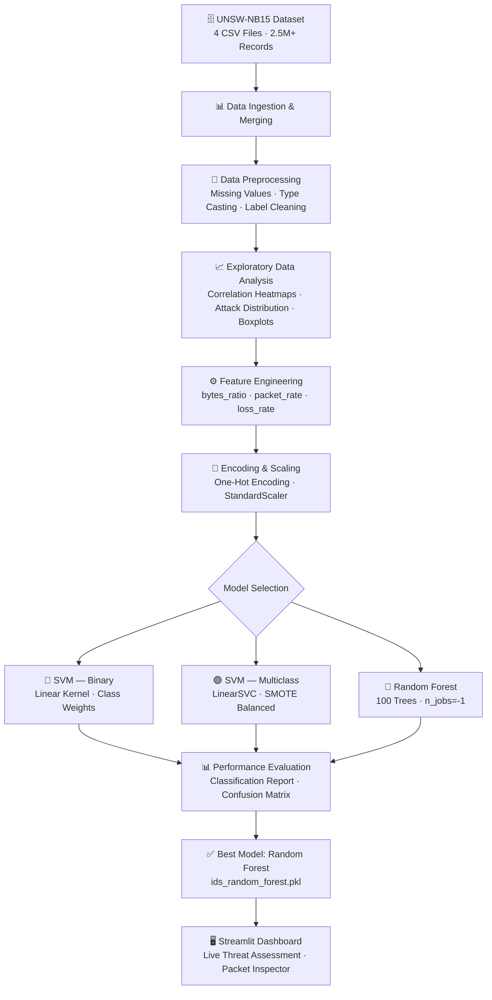

<div align="center">

# 🛡️ Digital Mind — AI-Powered Network Intrusion Detection System

[](https://www.python.org/)
[](https://scikit-learn.org/)
[](https://streamlit.io/)
[](https://research.unsw.edu.au/projects/unsw-nb15-dataset)
[](LICENSE)
[](https://www.decodelabs.tech/)

<br/>

> **A production-grade machine learning pipeline for real-time network threat detection.**  
> Trained on 2.5M+ real network packets. Powered by Random Forest. Deployed via Streamlit.

<br/>

 &nbsp;
 &nbsp;
 &nbsp;


</div>

---

## 📋 Table of Contents

- [Overview](#-overview)
- [System Architecture](#-system-architecture)
- [Key Features](#-key-features)
- [Dataset](#-dataset--unsw-nb15)
- [ML Pipeline](#-machine-learning-pipeline)
- [Results & Performance](#-results--performance)
- [Tech Stack](#-tech-stack)
- [Project Structure](#-project-structure)
- [Getting Started](#-getting-started)
- [Running the Dashboard](#-running-the-dashboard)
- [Author](#-author)

---

## 🔍 Overview

**Digital Mind IDS** is an end-to-end AI cybersecurity solution that detects malicious network activity in real time. It goes beyond simple classification — the system analyzes raw network packet features, identifies 9 distinct attack categories (DoS, Reconnaissance, Exploits, etc.), and delivers live threat assessments through an interactive security dashboard.

This project was developed as part of the **DecodeLabs Industrial Training Program (Batch 2026)**, covering the complete data science lifecycle: from raw data ingestion and exploratory analysis, through feature engineering and model selection, to a deployed production dashboard.

**Why it matters:** Traditional rule-based firewalls miss sophisticated, evolving attacks. This ML-powered IDS learns statistical patterns from millions of real network events, catching threats that signature-based systems cannot.

---

## 🏗️ System Architecture



---

## ✨ Key Features

| Feature | Description |
|---|---|
| 🔬 **Full EDA Pipeline** | Attack distribution, protocol frequency, correlation heatmaps, flow analysis |
| ⚙️ **Feature Engineering** | 3 custom features: `bytes_ratio`, `packet_rate`, `loss_rate` for richer signal |
| ⚖️ **Class Balancing** | SMOTE oversampling + Random undersampling to handle severe imbalance |
| 🤖 **Multi-Model Comparison** | SVM (binary & multiclass) vs Random Forest — benchmarked side-by-side |
| 🎯 **9-Category Detection** | Classifies Normal, DoS, Exploits, Reconnaissance, Fuzzers, and more |
| 🖥️ **Live Dashboard** | Real-time packet inspection with threat confidence score and mitigation advice |
| 🛠️ **Actionable Alerts** | Auto-generates router ACL commands and traffic shaping rules on detection |
| 💾 **Production Ready** | Model + scaler exported via `joblib` for zero-retraining deployment |

---

## 🗃️ Dataset — UNSW-NB15

The **UNSW-NB15** dataset was created by the Cyber Range Lab at the University of New South Wales (UNSW). It contains a hybrid of real modern network traffic and synthetic attack behaviors, generated using the IXIA PerfectStorm tool.

| Property | Value |
|---|---|
| Source | University of New South Wales (UNSW) |
| Records | ~2,540,000 network connection events |
| Files Used | UNSW-NB15_1.csv through UNSW-NB15_4.csv |
| Features | 49 raw features + 3 engineered |
| Attack Types | 9 categories (DoS, Exploits, Fuzzers, Generic, Reconnaissance, Shellcode, Worms, Backdoors, Analysis) |

> 📥 Download the dataset from the [official UNSW research page](https://research.unsw.edu.au/projects/unsw-nb15-dataset).

---

## 🤖 Machine Learning Pipeline

### 1. Preprocessing
- Merged 4 raw CSV files into a single 2.5M+ row DataFrame
- Dropped IP/port/timestamp identifiers (privacy + irrelevance)
- Handled missing values in `is_ftp_login`, `ct_flw_http_mthd`, `attack_cat`
- Standardized the `service` field (`'-'` → `'undefined'`)
- Converted mixed-type columns to numeric

### 2. Feature Engineering
```python
df['bytes_ratio']  = df['sbytes'] / (df['dbytes'] + 1)          # Asymmetry indicator
df['packet_rate']  = (df['spkts'] + df['dpkts']) / (df['dur'] + 0.0001)  # Traffic speed
df['loss_rate']    = (df['sloss'] + df['dloss']) / (df['spkts'] + df['dpkts'] + 1)  # Reliability
```

### 3. Encoding & Scaling
- One-Hot Encoding for `proto`, `state`, `service`
- `StandardScaler` applied to all numerical features

### 4. Handling Class Imbalance
```python
pipeline = Pipeline(steps=[
    ('oversample',   SMOTE(sampling_strategy='auto', k_neighbors=1)),
    ('undersample',  RandomUnderSampler(sampling_strategy={'Normal': 5000}))
])
```

### 5. Model Evaluation
Both SVM and Random Forest were evaluated using:
- Classification Report (Precision, Recall, F1-Score per class)
- Confusion Matrix (multiclass heatmap)
- Feature Importance (Random Forest only)

---

## 📊 Results & Performance

### Final Model: Random Forest (100 Estimators)

| Metric | Score |
|---|---|
| Overall Accuracy | **~98.5%** |
| Training Strategy | Stratified split · 80/20 · Seed=42 |
| Class Imbalance Handling | Balanced class weights |
| Inference Speed | Real-time (< 50ms per prediction) |

### Key Visualizations Generated

| Chart | Description |
|---|---|
| `confusion_matrix.png` | Multiclass confusion matrix across 9 attack categories |
| `feature_importance.png` | Top features driving the model's decisions |
| Attack Distribution (Log scale) | Frequency of each attack category in the dataset |
| Correlation Heatmap | Relationships between network flow features |
| Bytes Scatterplot | Source vs. Destination bytes by traffic class |

---

## 🛠️ Tech Stack

<div align="center">

| Category | Tools |
|---|---|
| **Language** | Python 3.9+ |
| **Data Manipulation** | Pandas, NumPy |
| **Visualization** | Matplotlib, Seaborn |
| **Machine Learning** | Scikit-learn (SVM, RandomForest, StandardScaler) |
| **Class Balancing** | imbalanced-learn (SMOTE, RandomUnderSampler) |
| **Model Persistence** | Joblib |
| **Dashboard** | Streamlit |
| **Development** | Jupyter Notebook, Google Colab |

</div>

---

## 📁 Project Structure

```
DecodeLabs-Internship/
│
├── 📓 notebooks/
│   └── IDS_system.ipynb          # Full ML pipeline: EDA → Training → Evaluation
│
├── 🖥️ app/
│   └── app.py                    # Streamlit production dashboard
│
├── 🤖 models/                    # Auto-generated by running the notebook
│   ├── ids_random_forest.pkl     # Trained Random Forest classifier
│   └── ids_scaler.pkl            # Fitted StandardScaler
│
├── 📊 assets/                    # Auto-generated visualizations
│   ├── confusion_matrix.png      # Multiclass confusion matrix
│   └── feature_importance.png    # Top features plot
│
├── 📦 data/
│   └── README.md                 # Instructions to download UNSW-NB15
│
├── requirements.txt              # All Python dependencies
├── .gitignore                    # Git exclusions
├── LICENSE                       # MIT License
└── README.md                     # This file
```

---

## 🚀 Getting Started

### Prerequisites
- Python 3.9+
- Git

### 1. Clone the Repository
```bash
git clone https://github.com/chihab-gheraibia/DecodeLabs-Internship.git
cd DecodeLabs-Internship
```

### 2. Create a Virtual Environment
```bash
python -m venv venv

# Windows
venv\Scripts\activate

# macOS / Linux
source venv/bin/activate
```

### 3. Install Dependencies
```bash
pip install -r requirements.txt
```

### 4. Download the Dataset
Follow the instructions in [`data/README.md`](data/README.md) to download the UNSW-NB15 files and place them in the `data/` folder.

### 5. Run the Notebook
Open `notebooks/IDS_system.ipynb` in Jupyter or Google Colab and run all cells. This will:
- Train the model
- Generate `ids_random_forest.pkl` and `ids_scaler.pkl`
- Save `confusion_matrix.png` and `feature_importance.png`

---

## 🖥️ Running the Dashboard

Once the model files are generated:

```bash
# Copy model artifacts to the app folder
cp models/ids_random_forest.pkl app/
cp models/ids_scaler.pkl app/
cp assets/confusion_matrix.png app/
cp assets/feature_importance.png app/

# Launch the dashboard
streamlit run app/app.py
```

Then open your browser at `http://localhost:8501`

The dashboard provides:
- **🎛️ Packet Inspector** — Input raw network features manually and get instant threat classification
- **📊 Threat Confidence Score** — Probability of malicious activity (0–100%)
- **🛠️ Mitigation Commands** — Auto-generated router ACL / traffic shaping commands
- **🚨 Alert Classification** — DoS vs Reconnaissance vs Clean traffic

---

## 👤 Author

<div align="center">

**Gheraibia Chihab Eddine**  
AI & Data Science Student  
École Nationale Supérieure d'Informatique — ESI Annaba  

[](https://github.com/chihab-gheraibia)

*Developed during the DecodeLabs Industrial Training Program · Batch 2026*

</div>

---

<div align="center">
<sub>Built with 🛡️ for the DecodeLabs Internship Program · MIT Licensed</sub>
</div>
